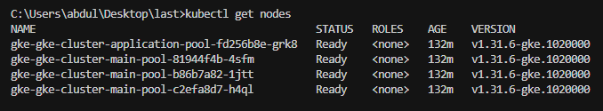
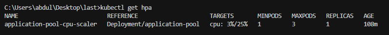
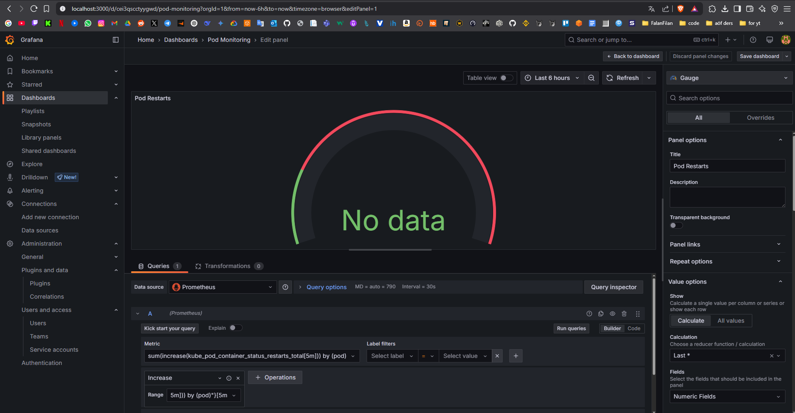
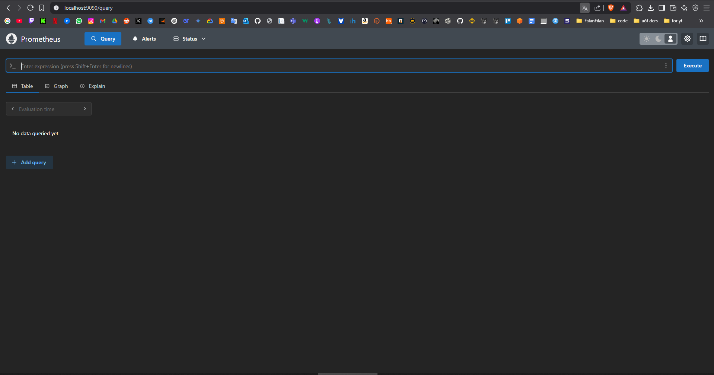

# Enuygun - GKE Kubernetes Altyapı Projesi

Bu proje, Enuygun için Google Kubernetes Engine (GKE) üzerinde modern bir mikroservis altyapısı oluşturmayı amaçlamaktadır. Proje, Infrastructure as Code (IaC) prensibiyle Terraform kullanılarak oluşturulmuş ve Kubernetes best practice'leri göz önünde bulundurularak tasarlanmıştır.

## Proje Görünümü

### Cluster ve Node Pool'lar
Cluster'daki node'ların genel görünümü:


Node'ların detaylı etiket bilgileri:


### Monitoring ve Service Mesh Bileşenleri
Monitoring namespace'indeki pod'lar:


Istio system namespace'indeki bileşenler:


KEDA namespace'indeki bileşenler:


### Auto-scaling Yapılandırması
HPA (Horizontal Pod Autoscaler) durumu:


## Proje Gereksinimleri ve Çözümleri

### 1. GKE Cluster Yapılandırması
- ✅ Google Kubernetes Engine üzerinde cluster oluşturuldu
- ✅ Logging ve monitoring özellikleri disable edildi
- 📝 Yapılandırma: `gke.tf` dosyasında

```hcl
resource "google_container_cluster" "primary" {
  logging_service    = "none"
  monitoring_service = "none"
  # ... diğer yapılandırmalar
}
```

### 2. Node Pool Mimarisi
- ✅ İki ayrı node pool oluşturuldu:
  - `main-pool`: Sistem bileşenleri için
  - `application-pool`: Uygulama workload'ları için
- ✅ n2d makine tipi kullanıldı
- ✅ europe-west-1 bölgesinde konumlandırıldı
- ✅ Auto-scaling yapılandırması:
  - main-pool: Sabit node sayısı
  - application-pool: 1-3 node arası otomatik ölçeklendirme

### 3. Kubernetes Uygulama Deployment
- ✅ YAML manifest ile örnek uygulama deploy edildi
- ✅ NodeSelector ile application-pool'a yönlendirildi
- 📝 Yapılandırma: `kubernetes/application-pool.yaml`

### 4. Horizontal Pod Autoscaling (HPA)
- ✅ CPU kullanımına dayalı otomatik ölçeklendirme
- ✅ Threshold: %25 CPU kullanımı
- ✅ Scale aralığı: 1-3 pod
- 📝 Yapılandırma: HPA manifest içinde

### 5. Monitoring Stack
- ✅ Prometheus kurulumu
  - Kubernetes metriklerini toplama
  - Metric retention: 15 gün
- ✅ Grafana kurulumu
  - Özelleştirilmiş dashboard'lar
  - Pod restart alarmları
  - Slack entegrasyonu
- 📝 Yapılandırma: `kubernetes/monitoring/values.yaml`

### 6. Pod Restart Alarmı
- ✅ Grafana üzerinden alarm kurulumu
- ✅ Slack entegrasyonu ile bildirimler
- ✅ Alert kuralları:
  - Trigger: Pod restart sayısı > 0
  - Süre: 5 dakika içinde
  - Bildirim: Slack kanalına

### 7. KEDA (Kubernetes Event-driven Autoscaling)
- ✅ KEDA kurulumu tamamlandı
- ✅ HPA ile entegre çalışacak şekilde yapılandırıldı
- 📝 Yapılandırma: `kubernetes/keda/` dizininde

### 8. Istio Service Mesh
- ✅ Istio core bileşenleri kuruldu:
  - istiod
  - istio-ingress
  - istio-egress
- 📝 Yapılandırma: `kubernetes/istio/` dizininde

## Kurulum Adımları

### Ön Gereksinimler
- Google Cloud Platform hesabı
- Terraform (v1.0.0+)
- kubectl
- gcloud CLI
- Helm v3
- istioctl

### 1. GCP Kimlik Doğrulaması
```bash
gcloud auth application-default login
```

### 2. Terraform ile Altyapı Kurulumu
```bash
terraform init
terraform plan
terraform apply
```

### 3. Kubernetes Bağlantısı
```bash
gcloud container clusters get-credentials [CLUSTER_NAME] --region europe-west1
```

### 4. Monitoring Stack Kurulumu
```bash
helm repo add prometheus-community https://prometheus-community.github.io/helm-charts
helm repo update
helm install monitoring prometheus-community/kube-prometheus-stack -f kubernetes/monitoring/values.yaml
```

### 5. KEDA Kurulumu
```bash
kubectl apply -f kubernetes/keda/keda-install.yaml
kubectl apply -f kubernetes/keda/keda.yaml
```

### 6. Istio Kurulumu
```bash
istioctl install --set profile=demo -y
kubectl apply -f kubernetes/istio/gateway.yaml
```

### 7. Uygulama Deployment
```bash
kubectl apply -f kubernetes/application-pool.yaml
```

## Monitoring ve Dashboard Erişimi

### Grafana
```bash
kubectl port-forward svc/monitoring-grafana 3000:80
# URL: http://localhost:3000
```


### Prometheus
```bash
kubectl port-forward svc/monitoring-prometheus 9090:9090
# URL: http://localhost:9090
```


## Proje Dizin Yapısı
```
.
├── README.md
├── main.tf                 # Terraform ana yapılandırması
├── gke.tf                 # GKE cluster yapılandırması
├── network.tf             # Ağ yapılandırması
├── variables.tf           # Terraform değişkenleri
├── terraform.tfvars       # Terraform değişken değerleri
├── kubernetes/
│   ├── application-pool.yaml    # Uygulama deployment
│   ├── monitoring/
│   │   └── values.yaml         # Prometheus/Grafana yapılandırması
│   ├── keda/
│   │   ├── keda-install.yaml   # KEDA kurulum
│   │   └── keda.yaml          # KEDA yapılandırması
│   └── istio/
│       ├── gateway.yaml        # Istio gateway
│       └── istio-operator.yaml # Istio yapılandırması
```

## Güvenlik Notları
- 🔒 Tüm API anahtarları ve hassas bilgiler Kubernetes Secret olarak saklanmalıdır
- 🔒 Grafana admin şifresi production ortamında değiştirilmelidir
- 🔒 Slack webhook URL'si güvenli bir şekilde saklanmalıdır

## Temizlik
```bash
terraform destroy
```
